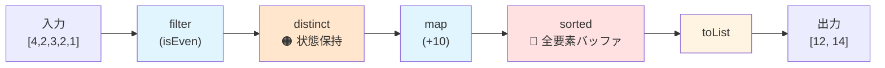
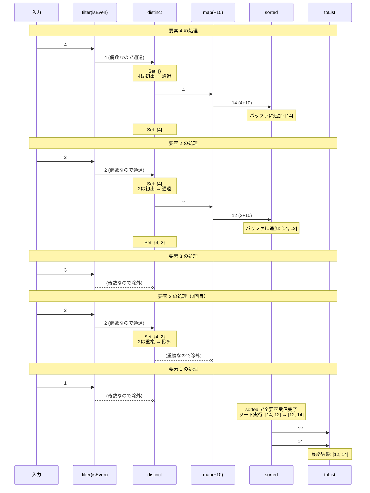

## はじめに

皆さん、こんにちは。
最近、Java の Stream API の**遅延処理の仕組み**について調べる機会があったのですが、内部構造がなかなか複雑で理解に苦労しました。
AI に支援してもらいながら、学習も兼ねて、自分で簡易版の MyStream クラスを実装してみたので、その内容を共有したいと思います。

本記事では、Java の Stream API の内部構造を理解するために、簡易版の MyStream クラスを実装し、ReferencePipeline や Sink といった内部コンポーネントの役割を解説します。
Stream API の「裏側」を知ることで、日常的に使用している `filter().map().toList()` といったメソッドチェーンの動作原理を深く理解できるようになることを目指します。

下記の記事はとても参考になりました。

- https://struchkov.dev/blog/en/java-stream-api/
- https://blog1.mammb.com/entry/2017/10/14/114917

## 環境

- Java Version: `corretto-17.0.17.10.1`

https://github.com/corretto/corretto-17/blob/17.0.17.10.1

## Java の Stream API の概要

### 遅延処理の仕組み

Java には Python の generator や JavaScript の iterator のような構文レベルのサポートがありません。

例えば、Python では、`yield` キーワードを使った generator 構文があり、JavaScript では、`function*` 構文と `yield` キーワードを使ってイテレーターを簡単に定義できるため、遅延処理が実装しやすいです。

一方、Java には `Iterator` インターフェースは存在しますが、`yield` のような**言語構文としての遅延処理機構**がないため、Stream API は**独自のパイプライン機構**を用いて遅延処理を実現しています。

Stream の動作は以下の 3 段階に分けられます:

1. **Stream の生成**: コレクションから `stream()` メソッドで Stream オブジェクトを作成
2. **中間操作**: `filter`, `map`, `sorted` などの操作をメソッドチェーンで連結（この時点ではまだ処理は実行されず、処理内容を記録するのみ）
3. **終端操作**: `toList`, `reduce` などが呼び出された時点で初めて実際のデータ処理が開始される

また、中間操作は、内部状態の保持の有無によって 2 種類に分類されます:

- **Stateless Operation**
  - 例: `filter`, `map`
  - 各要素を独立して処理し、他の要素に依存しない
  - 1 要素ずつ次のステージにパイプライン処理できる
- **Stateful Operation**
  - 例: `sorted`, `distinct`
  - 必要に応じて内部状態を保持する必要がある
    - `sorted` は全要素を受け取ってからソートする必要がある
    - `distinct` は重複を排除するために過去の要素を記憶する必要がある
  - メモリ消費量が大きくなる可能性がある

これを実現するために、Java の Stream API は 内部的に**ReferencePipeline** クラスと **Sink** インターフェースを組み合わせてパイプラインを構築しています。
ReferencePipeline は各中間操作を連結し、Sink は実際のデータフローを制御します。
（後述のコードで紹介しますが）どちらかというと、この 2 つのコンポーネントが遅延処理の中核を担っているコンポーネントと言えます。

### データフローの具体例

具体的なデータの流れを考えてみたいと思います。

以下の処理を例に、Stream API がどのようにデータを処理するか見ていきましょう。
この例では、`Stateless` 操作と `Stateful` 操作の両方を含むパイプラインを構築しています。
`Stateless` 操作は要素を逐次処理し、次の要素を待たずに後続の操作に要素を渡します。
`Stateful` 操作は、内部状態を保持する必要があるため、`sorted` の場合は全要素を受け取ってからソートを実行します。
一方で、`distinct` の場合は、すべての要素を受け取る必要がないため、過去の要素を記憶しながら逐次処理を行います。

```java
[4, 2, 3, 2, 1].stream()
  .filter(Main::isEven)    // 偶数のみ通過 (Stateless)
  .distinct()              // 重複排除 (Stateful: 状態保持型)
  .map(Main::add10)        // +10 (Stateless)
  .sorted()                // ソート (Stateful: 全要素バッファ型)
  .toList()                // リストに変換 (終端操作)
```

#### パイプライン全体の構造



**凡例:**

- 🔵 青: Stateless 操作（要素を逐次処理、状態なし）
- 🟠 オレンジ: Stateful 操作（状態を保持しながら逐次処理）
- 🔴 赤: Stateful 操作（全要素をバッファしてから処理）
- 🟡 黄: 終端操作（結果を収集）

#### 各要素の処理フロー



## 自作コード

今回の自作 MyStream では、下記の様な呼び出しを想定して必要な、クラスやインターフェースを実装しました。

```java
public class Main {
  public static void main(String[] args) {
    MyList myList = new MyList();
    myList.add(4);
    myList.add(3);
    myList.add(2);
    myList.add(1);
    myList.add(1);

    List<Integer> res21 = myList.stream().filter(Main::isEven).map(Main::add10).sorted().toList();
    List<Integer> res22 = myList.stream().filter(Main::isOdd).map(Main::add10).distinct().toList();
    Integer res23 = myList.stream().reduce(0, Main::acc);

    res21.forEach(System.out::println); // 12, 14
    res22.forEach(System.out::println); // 13, 11
    System.out.println(res23); // 11
  }

  static int add10(int val){
    return val + 10;
  }
  static boolean isEven(int val){
    return val % 2 == 0;
  }
  static boolean isOdd(int val){
    return val % 2 != 0;
  }
  static Integer acc(Integer acc, Integer val){
    return acc + val;
  }
}
```

MyList はコレクションを表し、`stream()` メソッドを通じて `filter`, `map`, `sorted`, `distinct`, `toList`, `reduce` といった操作をメソッドチェーンで実行できます。

今回の実装では、簡素化のために**要素の型を `Integer`** に固定していますが、実際の Java Stream API はジェネリクスを用いて任意の型に対応しています。

### 自作 MyList クラス

https://github.com/seiichi1101/java-my-stream/blob/main/MyList.java

MyList クラスは ArrayList と同様のコレクション実装で、以下の特徴を持ちます:

- `MyCollection` インターフェースを実装
- 内部で Integer 配列を保持
- `add()`, `size()`, `iterator()` などの基本的なコレクション操作を提供

このクラスは ArrayList の簡易版として実装しています。

### 自作 MyCollection インターフェース

https://github.com/seiichi1101/java-my-stream/blob/main/MyCollection.java

MyCollection インターフェースは、コレクション操作に必要なメソッドを定義します。

**重要なポイント: stream() メソッド**

`stream()` メソッドは **default メソッド** として定義されており、このインターフェースを実装するすべてのクラスで自動的に利用可能になります。

```java
default MyReferencePipeline stream() {
    return new MyReferencePipeline.Head(this);
}
```

このメソッドは `MyReferencePipeline.Head` のインスタンスを生成して返します。
Head は、`MyReferencePipeline` クラスの内部クラスとして定義されており、パイプラインの起点を表します。
戻り値の型が `MyReferencePipeline` であるため、以降のメソッドチェーンで中間操作や終端操作を連結できるという仕組みです。

#### **実際の Java との違い**

Java の実装では、`Collection#stream` の実装を読み進めると `StreamSupport.stream` を使い、そこから `ReferencePipeline.Head` を生成しています。
`StreamSupport` クラスは、Stream の生成をサポートするためのユーティリティクラスです。

https://github.com/corretto/corretto-17/blob/main/src/java.base/share/classes/java/util/Collection.java#L742-L744

https://github.com/corretto/corretto-17/blob/main/src/java.base/share/classes/java/util/stream/StreamSupport.java#L67-L72

また `Collection` インターフェースでは、stream() メソッドは `spliterator()` メソッドを使って Stream を生成しています。

https://github.com/corretto/corretto-17/blob/main/src/java.base/share/classes/java/util/Collection.java#L722-L725

この `spliterator()` メソッドは、コレクションに応じて、その要素を **分割(split)** して **繰り返し(iterator)** 処理するための `Spliterator` インスタンスを返します。
例えば、ArrayList の場合、`ArrayListSpliterator` クラスのインスタンスを返します。
実際の Java の Stream API は、この `Spliterator` を使い、必要に応じて要素を分割しながら効率的にストリーム処理を行う仕組みになっています。

### 自作 MyReferencePipeline クラス

https://github.com/seiichi1101/java-my-stream/blob/main/MyReferencePipeline.java

Stream API の中核を担うのが MyReferencePipeline クラスです。
このクラスは以下の特徴を持ちます:

- 中間操作 (`filter`, `map`, `sorted`, `distinct`) の実装
- 終端操作 (`toList`, `reduce`) の実装
- Sink インターフェースを用いたパイプラインチェーンの構築

パイプラインの構築では、以下の 2 段階で処理が行われます:

#### 1. 中間操作のチェーン化

中間操作は 2 種類の内部クラスに分類されます:

- `StatelessOp`: filter, map など
- `StatefulOp`: sorted, distinct など

各中間操作では `opWrapSink()` メソッドをオーバーライドした `MyReferencePipeline` インスタンスを返しています。
たとえば、`filter` 操作では、`opWrapSink()` メソッド内で Sink 実装を生成し、その Sink を持つ `StatelessOp` クラスのインスタンスを返しています。
この Sink は、条件を評価して条件を満たす要素だけを次の Sink(downstream) に渡す役割を担います。
**※MySink の`begin()`や`accept()`などのメソッドの説明は後述の MySink インターフェースのセクションで説明します。**

https://github.com/seiichi1101/java-my-stream/blob/main/MyReferencePipeline.java#L56-L79

`StatelessOp`は`MyReferencePipeline`のサブクラスとして定義されているため、`filter` メソッドの戻り値は `MyReferencePipeline` 型となり、以降のメソッドチェーンでさらに中間操作や終端操作を連結できます。

#### 2. 終端操作によるパイプラインの実行

終端操作が呼び出されると、以下の手順で処理が実行されます:

1. 終端用の Sink インスタンスを生成
2. `evaluate()` メソッドを呼び出し
3. `opWrapSink()` を使って各中間操作の Sink を逆順に連鎖
4. コレクションの要素を先頭から順番に流し込む

例えば、`toList()` 終端操作では、最終的に受け取った要素を ArrayList に詰め込む最後の Sink を生成します。

https://github.com/seiichi1101/java-my-stream/blob/main/MyReferencePipeline.java#L160-L178

この最後の Sink を起点に、今までの中間操作の Sink を逆順に連鎖させていきます。
この逆順の連鎖を行っているのが`wrapMySink()` メソッドです。

https://github.com/seiichi1101/java-my-stream/blob/main/MyReferencePipeline.java#L216-L226

`sink = p.opWrapSink(sink);` の部分で、パイプラインを遡って各中間操作の Sink を逆順に包み込んでいきます。
右辺では、現在の sink が `p.opWrapSink()` の引数として渡され、その Sink の downstream に設定されます。
左辺では、その戻り値が次のループで利用する sink 変数に代入されます。
これを `previousStage` が null になるまで繰り返すことで、全ての中間操作の Sink が連鎖されます。

https://github.com/seiichi1101/java-my-stream/blob/main/MyReferencePipeline.java#L204-L212

最後に、連鎖された Sink の最初のものに対して、コレクションの要素を順番に流し込むことで、パイプライン全体の処理が実行されます。

#### **実際の Java との違い**

https://github.com/corretto/corretto-17/blob/17.0.17.10.1/src/java.base/share/classes/java/util/stream/ReferencePipeline.java

実際の Java の ReferencePipeline クラスでは、さらに複雑な最適化や並列処理のサポートが組み込まれています。

たとえば `collect()` の終端処理一つとっても、`parallel`かどうかに応じて、異なる実装が選択されます。

https://github.com/corretto/corretto-17/blob/17.0.17.10.1/src/java.base/share/classes/java/util/stream/ReferencePipeline.java#L670-L687

https://github.com/corretto/corretto-17/blob/17.0.17.10.1/src/java.base/share/classes/java/util/stream/AbstractPipeline.java#L226-L235

### 自作 MySink インターフェース

https://github.com/seiichi1101/java-my-stream/blob/main/MySink.java

Sink インターフェースは、データフローを制御するためのコールバックメソッドを定義します。

- **`begin(long size)`**
  - データ処理の開始を通知
  - `size` パラメータは処理する要素数(不明な場合は -1)
  - Stateful 操作では、このサイズ情報を使って事前にバッファを確保し、パフォーマンスを最適化できる
- **`accept(Integer i)`**
  - 各要素を受け取るメソッド
  - Stateless 操作: 要素を処理し、条件に合えば即座に次の Sink へ渡す
  - Stateful 操作: 要素をバッファに蓄積し、必要な場合は後でまとめて処理する
- **`end()`**
  - データ処理の終了を通知
  - Stateful 操作では、バッファしていたデータの処理（ソートなど）をしてから次へ流す
  - 終端操作では、最終結果を構築する

上記のインターフェースを実装することで、各中間操作や終端操作は独自のデータ処理ロジックを定義します。たとえば:

- **filter**: 条件を満たす要素のみを次の Sink に渡す
- **map**: 要素を変換してから次の Sink に渡す
- **sorted**: 全要素をバッファリングし、ソート後に次の Sink に渡す

のように、処理に対応した Sink 実装を生成します。

また、終端操作でも Sink を生成し、`toList` では最終的に受け取った要素を ArrayList に詰め込み（JDK で可変リストを得たい場合は `collect(Collectors.toList())` などを利用します）、`reduce` では累積結果を計算します。

こうして ReferencePipeline と Sink を組み合わせることで、Java の Stream API は遅延処理とパイプライン処理を実現しています。

#### **実際の Java との違い**

https://github.com/corretto/corretto-17/blob/17.0.17.10.1/src/java.base/share/classes/java/util/stream/Sink.java

実際の Java の Sink インターフェースでは、もう少し多様なメソッドが定義されています。
例えば、`cancellationRequested()` メソッドは、処理の中断要求をチェックするために使用されます。

また、今回は定義だけして利用しなかった`begin(long size)` メソッドも、実際の Java では、`sorted` や `distinct` といった Stateful 操作で、事前にバッファサイズを確保するために利用されています。

## まとめ

いかがでしたでしょうか。
本記事では、Java の Stream API の内部構造を理解するために、簡易版の MyStream を実装しました。

実際の Java の ReferencePipeline には、並列処理や最適化などの高度な機能が組み込まれていますが、基本的な仕組みは今回実装したものと同じかと思います。（間違ってたらすみません。）

この実装を通じて、

- ReferencePipeline と Sink の協調によるパイプライン処理
- Stateless 操作と Stateful 操作の違いと実装方法
- 遅延処理を実現する仕組み

など、日常的に使用している `filter().map().toList()` といったメソッドチェーンの裏側で、どのような処理が行われているのかを理解できた気がします。
