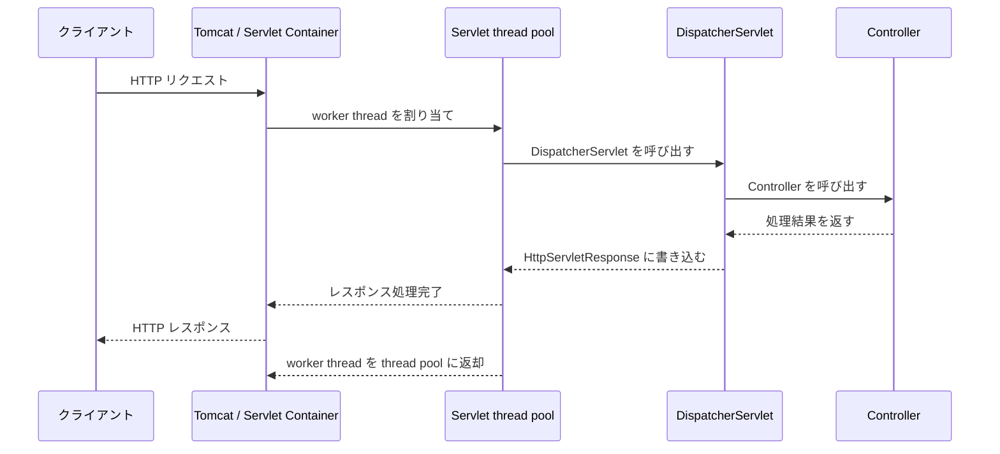
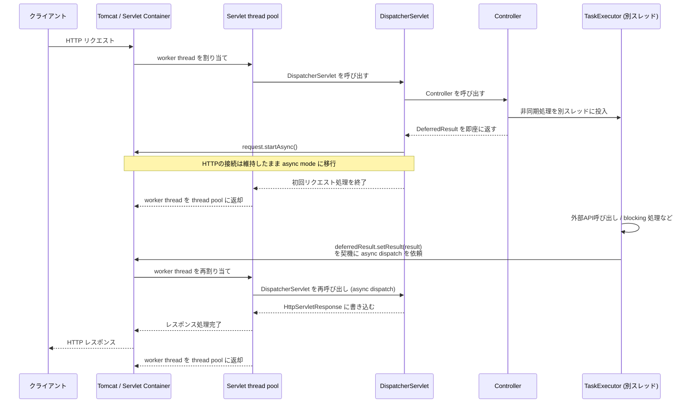

Spring MVC で Kotlin を使う際、下記の様に Controller の関数に `suspend` を付けることができます。

```kotlin
@RestController
class UserController(private val userService: UserService) {

    @GetMapping("/users/{id}")
    suspend fun getUser(@PathVariable id: Long): User {
        return userService.findById(id)
    }
}
```

本来、ノンブロッキングな処理を活かすなら Spring WebFlux を使う方が適していますが、Spring MVC でも suspend 関数をサポートすることで、非同期処理をよりシンプルに書けるようになっています。
今回は 「**Spring MVC の suspend 関数がどのように実装されているのか**」、内部実装を追ってみます。

## 背景のおさらい

内部実装を追う前に、そもそも Spring MVC がどのような仕組みで動いているのかを簡単におさらいしておきます。Spring MVC の内部の仕組みを理解しておくと、Spring MVC の suspend 関数の実装を理解する上で役立ちます。


### Servlet と Spring MVC

**Servlet** とは、HTTP request / response を扱うための標準仕様である Servlet API に従って実装される Java のコンポーネントです。Servlet は Tomcat、Jetty、Undertow などの **Servlet Container** 上で実行・管理されます。

Servlet Container は、クライアントから HTTP request を受け取ると、対応する Servlet へ `HttpServletRequest` や `HttpServletResponse` を渡して `request` / `response` を処理させます。Servlet では HTML などの動的な Web ページを生成したり、REST API のようにデータを処理することが可能です。一方で、Servlet API は低レベルであるため、開発者が直接 Servlet を実装するとコードが複雑になりがちです。

Spring MVC は、Spring Framework が提供する Web フレームワークです。Spring MVC では、**Spring MVC が提供する DispatcherServlet を Servlet として使用**しつつ、その上に Controller やアノテーションベースのルーティングなどの高レベルな仕組みを提供しています。

DispatcherServlet はリクエストを受け取ると Spring MVC の仕組みに沿って適切な Controller を呼び出し、処理結果を HTTP response として返します。そのため、開発者は Servlet を直接実装する代わりに、`@RestController` や `@GetMapping` などを使って Web アプリケーションを簡潔に実装できます。

```java
// Servletを直接実装する場合
protected void doGet(HttpServletRequest req, HttpServletResponse resp) {
    String id = req.getParameter("id");
    User user = service.getUser(id);
    resp.getWriter().write(user.toJson());
    ...
}

// Spring MVCを使う場合
@GetMapping("/users/{id}")
User getUser(@PathVariable String id) {
    return service.getUser(id);
}
```

Spring MVC では、基本的に**1 つの HTTP request に対して Servlet Container の worker thread が 1 つ割り当てられます**。割り当てられたスレッド上で DispatcherServlet や Controller の処理が実行されます。例えば、Spring Boot のデフォルトでは Tomcat が Servlet Container として使われるため、Tomcat がリクエスト処理用のスレッドプールを管理します。



この 1 リクエスト 1 スレッドというモデルは理解しやすく実装も容易ですが、I/O 待ちの間もスレッドが占有されるため、同時接続数が増えると、スレッドの枯渇や大量スレッド間でのコンテキストスイッチによるオーバーヘッドが発生するという問題があります。

### 非同期 Servlet

従来の同期的な Servlet / Spring MVC モデルでは、**1 つのリクエスト処理が完了するまで Servlet Container の worker thread が占有されます**。そのため、SSE (Server-Sent Events)や Long Polling のようにレスポンスを長時間 Open にする処理では、スレッドを長期間占有しやすいという問題があります。

この問題に対応するため、Servlet 3.0 で Servlet API に**非同期処理機構が追加**され、`AsyncContext` が導入されました。`AsyncContext` は Servlet そのものではなく、`ServletRequest.startAsync()` によって取得される非同期処理用のコンテキストです。`AsyncContext` を使うと、リクエスト処理を一時停止して worker thread を解放し、別のスレッドで非同期処理を続行します。非同期処理が完了したら `AsyncContext.complete()` を呼び出してレスポンスを完了させます。

```java
// AsyncContext を使った非同期処理の例
@WebServlet(urlPatterns = "/async", asyncSupported = true)
public class AsyncServlet extends HttpServlet {
    @Override
    protected void doGet(HttpServletRequest req, HttpServletResponse resp) {
        // doGet() が return しても response は完了せず、AsyncContext を通じて後続処理を継続できる
        // worker thread は doGet() return 後に thread pool へ返却される
        AsyncContext ctx = req.startAsync();

        // Runnable を AsyncContext に投入する
        ctx.start(() -> {
            // このblockの処理は、Servlet container 管理下の別スレッドで非同期的に実行される
            String result = callExternalApi();

            try {
                resp.getWriter().write(result);
            } catch (IOException e) {
                throw new RuntimeException(e);
            } finally {
                ctx.complete(); // response を完了する
            }
        });
    }
}
```

Spring MVC では、`DispatcherServlet` がこの **Servlet API の非同期処理機構** を利用し、`Callable`, `DeferredResult`, `SseEmitter`, `ResponseBodyEmitter` などの戻り値を非同期リクエスト処理として扱えるようになっています。

- `DeferredResult` の例

```java
@GetMapping("/async")
public DeferredResult<String> async() {
    DeferredResult<String> deferredResult = new DeferredResult<>();
    // 別スレッドで非同期処理を実行する
    taskExecutor.execute(() -> {
        String result = callExternalApi();
        deferredResult.setResult(result);
    });
    return deferredResult;
}
```

`DeferredResult` を返した場合の流れを図解すると、以下のようになります。Controller は非同期処理を別スレッドに投入して `DeferredResult` を即座に返し、worker thread はいったん解放されます。その後、別スレッド側で `setResult()` が呼ばれたことを契機に **async dispatch**（2 回目の dispatch）が発生し、再割り当てされた worker thread がレスポンスを書き込みます。



これにより I/O 待ち中にスレッドを解放できるようになりましたが、コールバックベースのコードが複雑になりやすいという問題が残りました。

### Reactive Programming の台頭

外部 API 連携・大量同時接続・ストリーミング・イベントドリブン なシステムが増えるにつれ、コールバックよりも宣言的に非同期処理を記述できる **Reactive Programming** が注目されるようになりました。

Reactive Programming とは、**データストリームと変化の伝播**を中心に据えた**プログラミングパラダイム**です。

Java エコシステムでは [Project Reactor](https://projectreactor.io/) が代表的な実装です。Reactor は `Mono` と `Flux` という主要な型を提供し、 `Publisher` でデータの流れを表現します。

- Project Reactor の主要型

| 型        | 意味                                  |
| --------- | ------------------------------------- |
| `Mono<T>` | 0 または 1 件の値を発行する Publisher |
| `Flux<T>` | 0 件以上の値を発行する Publisher      |

```java
// Mono
// Publisher: 処理を定義する
Mono<String> monoPublisher =
        Mono.just("Alice")
            .map(String::toUpperCase)
            .filter(name -> name.startsWith("A"));

// Subscriber: 値を受け取る
monoPublisher.subscribe(System.out::println); // ALICE

// Flux
// Publisher: 処理を定義する
Flux<String> fluxPublisher =
        Flux.just("Alice", "Bob", "Charlie")
            .filter(name -> name.length() >= 5)
            .map(String::toUpperCase);

// Subscriber: 値を受け取る
fluxPublisher.subscribe(System.out::println); // ALICE, CHARLIE
```

Mono / Flux の特徴の一つに **遅延評価**（lazy）があります。このため、基本的には`subscribe()` のような終端操作が呼ばれるまで Publisher も Operator も実行されません。

また、どちらも `Publisher<T>` インターフェース（Reactive Streams 仕様）を実装しています。
Reactive Streams は、Publisher と Subscriber の間でデータをやり取りするための仕様です。（ちなみに、Subscriber には `Subscription.request(n)` を通じて必要なデータ量を要求する `backpressure` の仕組みも含まれています。）

```java
public interface Publisher<T> {
    void subscribe(Subscriber<? super T> subscriber);
}
```

Spring Framework 5.0 では、Spring MVC に Reactive Streams ベースの型を戻り値として扱うためのサポートが追加されました。これにより、Controller メソッドから Mono、Flux、RxJava などの Reactive API の戻り値をそのまま返せるようになりました。内部的には、Mono / Flux を Publisher に変換し、Subscribe した結果を Servlet API の非同期処理機構に渡すといった処理が行われます。（後述）

```java
// Spring MVC のコントローラーは Mono/Flux を返せる
@RestController
class UserController {
    // 単一リソースの取得: Mono<T> を返す
    @GetMapping("/users/{id}")
    public Mono<User> getUser(@PathVariable Long id) {
        // reactive な戻り値をそのまま返せる
        return webClient.get()
                .uri("/users/{id}", id)
                .retrieve()
                .bodyToMono(User.class);
    }

    // 複数リソースの取得: Flux<T> を返す
    @GetMapping("/users")
    public Flux<User> getUsers() {
        // 複数件の reactive な戻り値もそのまま返せる
        return webClient.get()
                .uri("/users")
                .retrieve()
                .bodyToFlux(User.class);
    }
}
```

同じく Spring Framework 5.0 で、Reactive Streams と Project Reactor を基盤とする新しい Web スタックとして **Spring WebFlux** も導入されました。これにより、従来の Spring MVC の Controller のようなコードスタイルを保ちつつ、非同期ストリームを直接扱えるようになりました。

ちなみに Spring MVC と Spring WebFlux は、Spring Framework をベースにしていますが、非同期処理の基盤が根本的に異なるので注意が必要です。

| 観点                 | Spring MVC                                                                                        | Spring WebFlux                    |
| -------------------- | ------------------------------------------------------------------------------------------------- | --------------------------------- |
| 主な基盤             | Servlet API                                                                                       | Reactive Streams                  |
| 実行モデル           | blocking servlet + request-per-thread                                                             | non-blocking + event-loop         |
| 主なサーバー         | Tomcat, Jetty など                                                                                | Netty, Tomcat, Jetty など         |
| Controller 戻り値    | `Object`, `ResponseEntity`, `Callable`, `DeferredResult`, `CompletableFuture`, `Mono`, `Flux`など | `Mono`, `Flux` など               |
| DB アクセス          | JDBC / JPA が一般的                                                                               | R2DBC / reactive drivers が一般的 |
| プログラミングモデル | imperative                                                                                        | reactive                          |

### Kotlin Coroutine のサポート追加

一方で、Kotlin のサーバーサイド採用が進む中、**Spring Framework 5.2 で Spring WebFlux、Spring Framework 5.3 で Spring MVC に Kotlin suspend 関数のサポートが追加**されました。

https://github.com/spring-projects/spring-framework/issues/23611

Kotlin Coroutine では、非同期処理を同期的なコードスタイルで書くことができます。Spring MVC では、 `kotlinx-coroutines-reactor` を使って suspend 関数を Reactor の `Mono` に変換し、Servlet API の非同期処理機構と統合させる方式を採用しています。

Spring MVC と Spring WebFlux ともに Controller メソッドで `Mono` や `Flux` を直接返すことができるようになっているため、どちらの Web スタックでも、Kotlin Coroutine を使うことができます。

利用する際の設定は非常にシンプルで、以下の 2 点だけです。

- **依存関係の追加**

```kts
dependencies {
    implementation("org.jetbrains.kotlinx:kotlinx-coroutines-core")
    implementation("org.jetbrains.kotlinx:kotlinx-coroutines-reactor")
}
```

- **Controller に suspend を付ける**

```kotlin
@RestController
class UserController(private val userService: UserService) {

    @GetMapping("/users/{id}")
    // suspend 関数の例
    suspend fun getUser(@PathVariable id: Long): User {
        return userService.findById(id) // suspend function
    }
}
```

公式ドキュメント: https://docs.spring.io/spring-framework/reference/languages/kotlin/coroutines.html

## Spring MVC + Suspend Controller の仕組み

ポイントになるのが、`kotlinx-coroutines-reactor` というライブラリです。
`kotlinx-coroutines-reactor` は、Kotlin Coroutine と Reactor の橋渡しをする役割があります。このライブラリが提供する `mono()` を使うことで、suspend Controller を Reactor の `Mono` に変換できます。

```kotlin
import kotlinx.coroutines.reactor.mono

// suspend 関数 → Mono への変換
val mono: Mono<User> = mono {
    suspendController(1) // suspend 関数のControllerを呼び出す
}

// suspend 関数のController
suspend fun suspendController(id: Int): User {
    // suspend function の処理
    ...
}
```

この変換機能により、Kotlin の suspend 関数が Servlet API の 非同期処理機構と統合できるようになります。 今回は

1. **suspend Controller を Mono に変換する**
2. **Spring MVC が Publisher を受け取り非同期処理する**

部分に注目して、Spring MVC が内部的に suspend 関数をどのように扱っているのかを追ってみます。

### その 1: suspend Controller を Mono に変換する

Spring が suspend 関数を呼び出す際の中心的な処理は `CoroutinesUtils.invokeSuspendingFunction` です。この関数では、reactive な戻り値 `Publisher<?>` を返すために、`kotlinx-coroutines-reactor` の `MonoKt.mono()` を使って suspend 関数を Mono に変換しています。

https://github.com/spring-projects/spring-framework/blob/c997d4018d3dc6a7dde2e20eae3627599a01e169/spring-core/src/main/java/org/springframework/core/CoroutinesUtils.java#L117-L164

このメソッドがやっていることを順に見てみます。

- **Kotlin リフレクションで関数情報を取得する**

Java の `Method` オブジェクトから Kotlin の関数メタデータ (`KFunction`) を取得します。これにより、パラメータの型情報やインラインクラスかどうかといった Kotlin 固有の情報を扱えるようになります。

https://github.com/spring-projects/spring-framework/blob/c997d4018d3dc6a7dde2e20eae3627599a01e169/spring-core/src/main/java/org/springframework/core/CoroutinesUtils.java#L122

- **`MonoKt.mono()` で suspend 関数を Mono に変換する**

`MonoKt.mono()` は `kotlinx-coroutines-reactor` が提供する関数で、第 2 引数(`block`)に suspend 関数型を受け取り、その処理を `Mono` に変換します。`CoroutinesUtils.java`は Java コードのため suspend ラムダ(`(scope, continuation) -> { ... }`)が渡されます。処理が一時停止した場合は `COROUTINE_SUSPENDED`を返し、再開時には`Continuation.resumeWith()` が呼ばれるという通常の Coroutine のフローになります。（Continuation の仕組みについては、[こちら](<https://zenn.dev/seiichi1101/articles/kotlin-coroutine#coroutine-%E3%81%AE%E4%B8%AD%E6%96%AD%E3%83%BB%E5%86%8D%E9%96%8B%E3%82%92%E6%94%AF%E3%81%88%E3%82%8B%E4%BB%95%E7%B5%84%E3%81%BF-(suspend-%E9%96%A2%E6%95%B0-%E3%81%A8-continuation)>)の記事を参照してください。）

https://github.com/spring-projects/spring-framework/blob/c997d4018d3dc6a7dde2e20eae3627599a01e169/spring-core/src/main/java/org/springframework/core/CoroutinesUtils.java#L127

`block` 内では、必要パラメータの取り出しなどいろいろやっていますが、最終的には`KCallables.callSuspendBy()` で、リフレクション経由で Controller 関数を呼び出しています。

https://github.com/spring-projects/spring-framework/blob/c997d4018d3dc6a7dde2e20eae3627599a01e169/spring-core/src/main/java/org/springframework/core/CoroutinesUtils.java#L148

- **戻り値の型によって変換を分岐する**

一旦 `Mono` を作成した後、戻り値の型によって変換を分岐しています。suspend 関数の宣言上の戻り値型を`KFunction#getReturnType()`で確認し、戻り値が `Flow` や `Publisher` 系の型であれば、作成済みの `Mono` をさらに flatten し、呼び出し元に返却しています。最終的な戻り値の型は `Publisher<?>` になります。

https://github.com/spring-projects/spring-framework/blob/c997d4018d3dc6a7dde2e20eae3627599a01e169/spring-core/src/main/java/org/springframework/core/CoroutinesUtils.java#L153-L163

| 戻り値の型     | 変換方法                                      |
| -------------- | --------------------------------------------- |
| `Flow<T>`      | `flatMapMany()` で `Flux` に変換              |
| `Mono<T>`      | ネストした `Mono` を `flatMap()` でフラット化 |
| `Publisher<T>` | `flatMapMany()` でストリーム化                |
| それ以外       | `Mono<T>` としてそのまま返す                  |

### その 2: Spring MVC が Publisher を受け取り非同期処理する

Publisher に変換された戻り値は、Spring MVC で Mono / Flux を返却した場合と同じフローで処理されます。Spring MVC 内部では、Mono / Flux の戻り値は `ReactiveTypeHandler` に委譲されます。`ReactiveTypeHandler` は `ReactiveAdapterRegistry` を使って内部で subscribe した結果を Servlet API の非同期処理機構に渡します。

https://github.com/spring-projects/spring-framework/blob/c997d4018d3dc6a7dde2e20eae3627599a01e169/spring-webmvc/src/main/java/org/springframework/web/servlet/mvc/method/annotation/ReactiveTypeHandler.java#L140-L194

`ReactiveTypeHandler.handleValue()` では、戻り値が Streaming かどうかで処理が分かれます。

`suspend fun getUser(id: Long): User` のように通常の値を返す suspend 関数であれば Mono に変換されるため、非 Streaming のパスを通ります。`DeferredResult` を作成し、`DeferredResultSubscriber` で Publisher を subscribe した上で、`WebAsyncManager.startDeferredResultProcessing()` を呼び出して Servlet API の非同期処理を開始します。

https://github.com/spring-projects/spring-framework/blob/c997d4018d3dc6a7dde2e20eae3627599a01e169/spring-webmvc/src/main/java/org/springframework/web/servlet/mvc/method/annotation/ReactiveTypeHandler.java#L188-L194

`DeferredResultSubscriber` の実装を見ると、`onSubscribe()` で `request(Long.MAX_VALUE)` を要求して全要素を受け取り、`onNext()` で値を溜め込み、`onError()` / `onComplete()` のタイミングで `DeferredResult` に結果をセットしています。`DeferredResult` に結果がセットされると **async dispatch** が発生し、worker thread が再割り当てされてレスポンスが書き込まれます。つまり、**suspend 関数の完了 → `Mono` の完了シグナル → `DeferredResult.setResult()` → async dispatch** という流れで、coroutine が Servlet API の非同期処理機構と統合されていることがわかります。

https://github.com/spring-projects/spring-framework/blob/c997d4018d3dc6a7dde2e20eae3627599a01e169/spring-webmvc/src/main/java/org/springframework/web/servlet/mvc/method/annotation/ReactiveTypeHandler.java#L501-L548

一方でスレッドの動きには注意が必要です。

Spring のデフォルトでは `Dispatchers.Unconfined` が使われるため、Coroutine は subscribe を実行したスレッド（Tomcat の worker thread）上で最初の suspension point まで実行されます。つまり、一度も suspend しないブロッキング処理を書いてしまうと、処理が終わるまで worker thread を占有し続けることになります。

処理が suspend する場合は、そこで`COROUTINE_SUSPENDED`が返却され、リクエストは async mode に移行した上で worker thread が解放されます。その後は、suspend した処理を resume する側のスレッドで処理が再開されます。`Dispatchers.Unconfined` は再開時のスレッドを指定しないため、どのスレッドで再開されるかは呼び出した suspend 関数の実装次第です。例えば `WebClient` の呼び出しなら Reactor Netty のイベントループスレッド、`delay()` なら kotlinx-coroutines 内部の `DefaultExecutor` スレッドで再開されます（`withContext(Dispatchers.IO)` などを明示的に使った場合は、その Dispatcher のスレッドで再開されます）。

一度も suspend しない suspend Controller であっても、 async dispatch 自体は通りますが、スレッド解放の恩恵は受けられません。むしろ async 機構を利用するためのオーバーヘッドが発生するため、処理が軽量な場合はかえってパフォーマンスが悪化する可能性があります。

## 備考（注意するポイント）

### ブロッキングな I/O ライブラリの利用は避ける

例えば、`RestTemplate` は blocking な HTTP クライアントです。suspend 関数内で `RestTemplate` を呼び出すと、呼び出し中はスレッドがブロックされ続けます。

```kotlin
// NG: RestTemplate はブロッキング
suspend fun callApi(): String {
    return restTemplate.getForObject("https://example.com", String::class.java)!!
    // ↑ スレッドをブロックしてしまう
}

// OK: WebClient の await 拡張関数を使う
suspend fun callApi(): String {
    return webClient.get()
        .uri("https://example.com")
        .awaitBody<String>()
}
```

### ThreadLocal に依存する値は suspension をまたいで保証されない

Servlet ベースの Spring MVC には、`SecurityContextHolder`（Spring Security）、ロギングの MDC など、ThreadLocal を前提とした仕組みが多くあります。前述の通り、coroutine は suspension point をまたぐと別スレッドで再開される可能性があるため、再開後の処理からはこれらの ThreadLocal の値が見えなくなる可能性があるので、注意が必要です。

```kotlin
suspend fun process() {
    // OK: Tomcat の worker thread 上で実行されるため、ThreadLocal の値が見える
    val before = SecurityContextHolder.getContext().authentication

    delay(100) // suspend する処理

    // NG: suspend した後の処理は別スレッドで再開される可能性があるため、ThreadLocal の値が見えない
    val after = SecurityContextHolder.getContext().authentication
}
```

### @Transactional は suspend 関数では期待通りに動かない（JDBC/JPA 環境）

`PlatformTransactionManager`（JDBC/JPA ベース）を使う通常の Spring MVC 環境では、`@Transactional` を suspend 関数に付けても期待通りに動作しません。

`TransactionInterceptor` は suspend 関数を通常のメソッドとして扱います。suspend 関数はコンパイル後、最初の suspension point に到達すると `COROUTINE_SUSPENDED` を即座に return するため、インターセプターはその時点で「メソッドが正常終了した」とみなしてトランザクションをコミットしてしまいます。つまり、**トランザクションが suspension をまたいで維持されません**。加えて、`PlatformTransactionManager` はトランザクションをスレッドローカルに紐付けるため、coroutine が別スレッドで再開された後の処理からはトランザクションが見えないという問題もあります。

```kotlin
// NG: PlatformTransactionManager 環境では @Transactional が suspension をまたげない
@Transactional
suspend fun updateUser(id: Long, name: String) {
    val externalUser = callSuspendFunctionToGetUser(id) // ← ここで suspend して COROUTINE_SUSPENDED が return された時点で、インターセプターがコミット処理を実行する
    val user = userRepository.findById(id)              //   さらに再開後は別スレッドの可能性があり、ThreadLocal のトランザクション情報も見えない
    userRepository.save(user.copy(name = name, externalUserName = externalUser.name))
}
```

対策としては、suspend 関数自体には `@Transactional` を付けず、`TransactionRunner` のような非 suspend のラッパーを作って、トランザクション境界を明示的に指定する方法があります。

```kotlin
@Component
class TransactionRunner {
    @Transactional(readOnly = true)
    fun <T> readOnly(block: () -> T): T = block()

    @Transactional
    fun <T> readWrite(block: () -> T): T = block()
}

// suspend 関数自体には @Transactional を付けない
suspend fun updateUser(id: Long, name: String) {
    val externalUser = callSuspendFunctionToGetUser(id) // suspend する処理はトランザクションの外で行う
    withContext(Dispatchers.IO) { // ブロッキング I/O のため、スレッド数に余裕のある Dispatchers.IO で実行する
        transactionRunner.readWrite {
            // このブロック内は同一スレッドで同期実行されるため、通常通りトランザクションが効く
            // (ブロック内で suspend 関数は呼ばないこと)
            val user = userRepository.findById(id)
            userRepository.save(user.copy(name = name, externalUserName = externalUser.name))
        }
    }
}
```

一方で、ReactiveTransactionManager（R2DBC）環境なら suspend 関数への `@Transactional` が公式サポートされているので、問題なく使えます。

### OncePerRequestFilter での操作は注意が必要

OncePerRequestFilter を使ってアクセスログを出力する場合、suspend 関数のコントローラーに対しては、request 時点の 1 回しか呼ばれません。

```kotlin
class AccessLogFilter : OncePerRequestFilter() {
    override fun doFilterInternal(request: HttpServletRequest, response: HttpServletResponse, filterChain: FilterChain) {
        try {
            filterChain.doFilter(request, response)
        } finally {
            log.info("access log: ${request.method} ${request.requestURI} ${response.status}")
        }
    }
}
```

上記の例では、`${response.status}` は、suspend 関数のコントローラーが完了する前（async 処理が開始された直後）に評価されるため、最終的なステータスコードではなく、その時点の未確定なステータス（通常は 200）が出力されます。

suspend 関数のコントローラーが完了した後のステータスコードを取得するには、`shouldNotFilterAsyncDispatch()` をオーバーライドして非同期 dispatch（2 回目の dispatch）でもフィルターを通すようにした上で、async 処理が開始された 1 回目ではなく、処理が完了したタイミングでログを出力する必要があります。この判定には `isAsyncStarted()` が使えます。

```kotlin
class AccessLogFilter : OncePerRequestFilter() {
    // async dispatch (2回目の dispatch) でもフィルターを通す
    override fun shouldNotFilterAsyncDispatch(): Boolean = false

    override fun doFilterInternal(request: HttpServletRequest, response: HttpServletResponse, filterChain: FilterChain) {
        try {
            filterChain.doFilter(request, response)
        } finally {
            // async 処理が開始された直後 (1回目の dispatch) はスキップし、
            // async dispatch 完了後、または同期リクエストの完了時のみログを出力する
            if (!isAsyncStarted(request)) {
                log.info("access log: ${request.method} ${request.requestURI} ${response.status}")
            }
        }
    }
}
```

### テストでは asyncDispatch が必要

例えば、統合テストで `MockMvc` を使う場合、suspend 関数のレスポンスは非同期で返ってくるため、`asyncDispatch` を使ってレスポンスを受け取る必要があります。

```kotlin
// NG: 非同期処理が完了する前にアサーションが実行されてしまう
mockMvc.perform(get("/users/1"))
    .andExpect(status().isOk)

// OK: 非同期処理が完了するまで待機する
val mvcResult = mockMvc.perform(get("/users/1"))
    .andExpect(request().asyncStarted())
    .andReturn()
mockMvc.perform(asyncDispatch(mvcResult))
    .andExpect(status().isOk)
    .andExpect(jsonPath("$.id").value(1))
```

### 例外は Mono.error() として伝播する

suspend 関数内で例外がスローされた場合、`mono {}` ブロックがキャッチして `Mono.error(e)` に変換します。Spring MVC はこれを subscribe しているため、通常の `@ExceptionHandler` や `@ControllerAdvice` でハンドリングできます。

```kotlin
@RestController
class UserController(private val userService: UserService) {
    @GetMapping("/users/{id}")
    suspend fun getUser(@PathVariable id: Long): User {
        return userService.findById(id) // NotFoundException を throw する可能性がある
    }
}

@RestControllerAdvice
class GlobalExceptionHandler {
    @ExceptionHandler(NotFoundException::class)
    fun handleNotFound(e: NotFoundException): ResponseEntity<ErrorResponse> {
        // suspend 関数からの例外も通常通りここでキャッチできる
        return ResponseEntity.status(404).body(ErrorResponse(e.message))
    }
}
```

ただし、coroutine のキャンセル例外（`CancellationException`）は、キャンセルの起点によって Mono 上での扱いが異なります。

- Mono の subscription 中に coroutine が キャンセル例外（`CancellationException`）で終了した場合は、通常の例外と同様に Mono のエラーとして伝播します。
- Subscriber 側、つまり Spring MVC から subscription がキャンセルされ、その結果 coroutine がキャンセルされた場合は、`onError` や `onComplete` は通知されません。(すでに Subscriber 側が結果を待っていないため不要と判断)

**後者の CancellationException は @ExceptionHandler では処理されないため**、キャンセル時にも必ず実行したいクリーンアップは、try-finally などで適切に行う必要があります。

## まとめ

Spring MVC での suspend 関数のサポートは、suspend 関数を `Mono` に変換し、Spring の非同期処理機構に統合することで実現されています。

完全な非ブロッキング処理を目指すなら WebFlux の方が適していますが、WebFlux へ移行するには、実行基盤の変更や DB アクセスドライバの R2DBC 化など、大掛かりな変更が必要になります。一方で、既存の Spring MVC アプリケーションに suspend 関数を導入することは、非同期処理へのファーストステップとして良い選択肢なのではないでしょうか。
