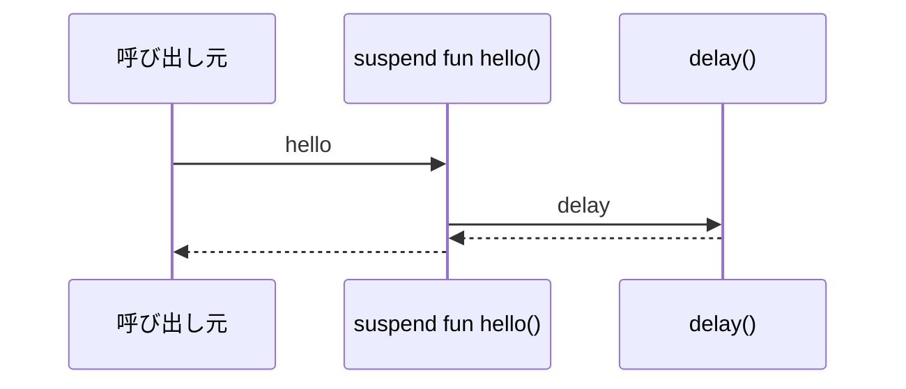
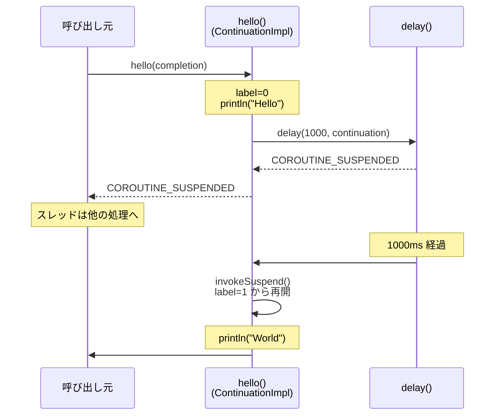
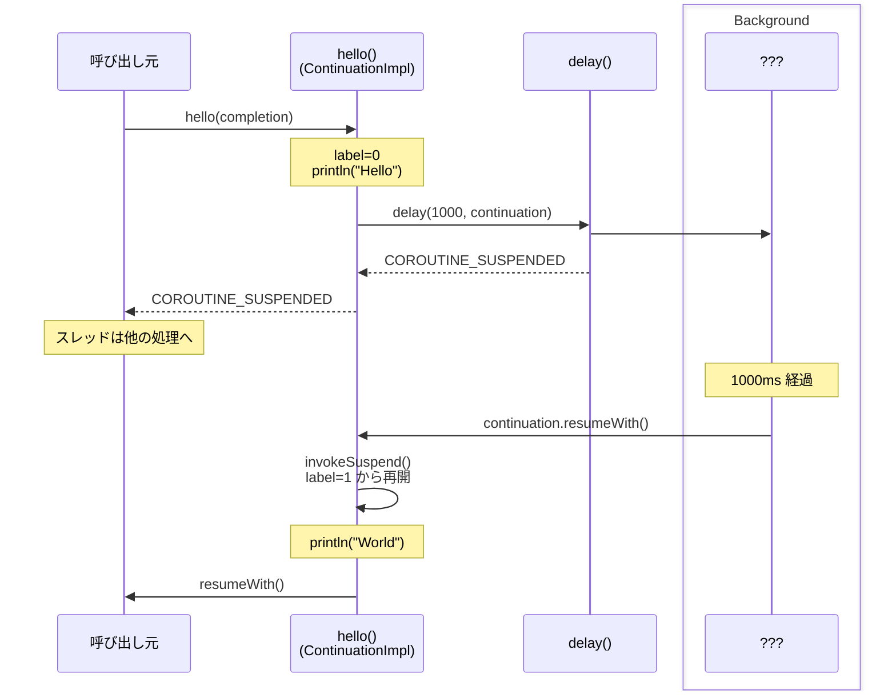
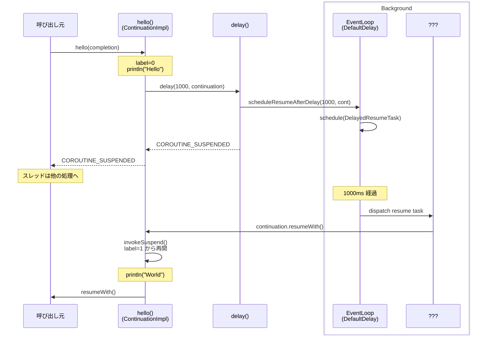
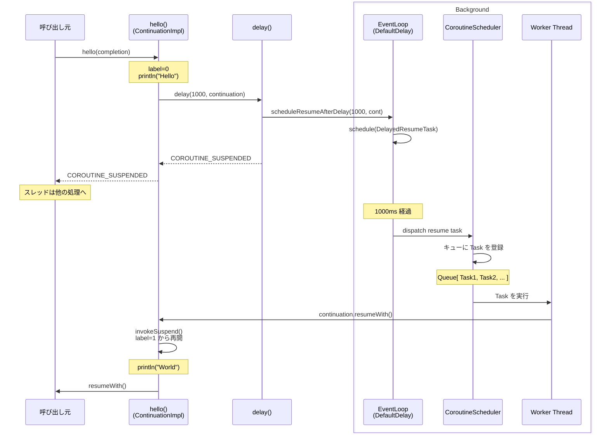

よくある Kotlin Coroutine の解説として、

> Kotlin の Coroutine は、軽量なスレッドのようなもので、非同期処理および並行処理を簡単に実装できる仕組みです。
> Coroutine では、suspend キーワードを使って**関数を一時停止・再開**できるようにし、非同期コードをシンプルに書くことができます。

こんな感じで説明されることが多いかと思います。なんとなく分かった気がするのですが、イマイチ全体像が掴めませんでした。

特に、`Coroutine, suspend, CoroutineScope, CoroutineContext, CoroutineDispatcher` などの用語がイマイチ覚えづらく、それぞれがどのように関連しているのかが分かりづらかったです。

そんな中で、下記の記事を読み、Kotlin Coroutine の概念と関連用語の全体像が少しずつ見えてきましたので、自分なりに整理するためにこの記事を書いてみました。（深く理解したい方は、ぜひ下記の記事を読んでみてください。おすすめです。）

https://zenn.dev/kaseken/articles/681c5aea0639c7

この記事では、Kotlin Coroutine の概念と関連用語を以下のような構成で説明していきます。

1. Coroutine の中断・再開を支える仕組み (suspend 関数 と Continuation)
2. Coroutine の実行を支える仕組み (CoroutineDispatcher)
3. Coroutine を構成するいくつかの要素 (CoroutineScope)
4. Coroutine を生成するための便利な関数

- 環境
  - `Kotlin version 2.3.20 (JRE 25.0.2+10-LTS)`
  - `kotlinx-coroutines-core:1.10.1`

## Coroutine の中断・再開を支える仕組み (suspend 関数 と Continuation)



ここでは、Coroutine を利用する上で最も基本的な概念である **suspend 関数**と **Continuation** について説明します。

https://kotlinlang.org/spec/asynchronous-programming-with-coroutines.html#implementation-details

まず、Coroutine で中断可能な処理を書くには、suspend 関数なるものが必要です。suspend 関数は、関数の前に `suspend` キーワードを付けることで定義される**一時停止と再開が可能な関数**です。（あくまで可能なだけ）
コンパイラはこの suspend 関数を、**Continuation オブジェクトを引数に取る関数**へと変換します。

- コンパイル前

```kotlin
suspend fun main() {
   withContext(Dispatchers.Default) {
       hello()
   }
}

suspend fun hello() {
    println("Hello")
    delay(1000)
    println("World")
}
```

- コンパイル後 (擬似コード)

```java
public static final Object hello(@NotNull Continuation $completion) {
    // 初回呼び出し時に ContinuationImpl を作成して、label で再開位置を管理する
    $continuation = new ContinuationImpl($completion) {
        Object result;
        int label; // 初期値は 0

        @Nullable
        public final Object invokeSuspend(@NotNull Object $result) {
            ...
            // 自分自身を呼び出す
            return ContinuationKt.hello((Continuation)this);
        }
    };

    switch ($continuation.label) {
        case 0:
            // 初回呼び出し時はここからスタート
            System.out.println("Hello");
            $continuation.label = 1; // labelを更新
            if (delay(1000, $continuation) == COROUTINE_SUSPENDED) {
                return COROUTINE_SUSPENDED // ここで一旦終了して、残りは後で再開される
            }
        case 1:
            // 後からinvokeSuspend で再開されたときはここからスタート
            ...
            break;
    }

    System.out.println("World");
    return Unit.INSTANCE;
}
```

このように、suspend 関数は Continuation を引数に受け取り、中断後に再開できる形のコードへと変換されます。コンパイル時のこの変換は、**CPS (Continuation-Passing Style) 変換**と呼ばれる技法で、非同期処理を段階的に実行するためのステートマシンのような構造を作成します。また、delay 関数も同様に、suspend 関数なので、Continuation を引数に取る形でコンパイルされます。

Coroutine が中断可能な場合、現在の実行状態（ローカル変数や再開位置を示す `label`）を Continuation オブジェクトとして保存し、`COROUTINE_SUSPENDED` を返します。（ちなみに、このような 中断可能な場所を**suspension point** と呼びます。）

つまり、関数の一部を実行して、一旦終了することになります。その後、任意のタイミングで、保存された状態をもとに `invokeSuspend` が呼び出され、label に応じて適切な位置から処理が再開されます。



Continuation とは、一言で言うと「**中断された suspend 関数を再開するためのハンドラ**」です。よくある非同期処理や遅延処理を実行するためのコールバックのような役割を担っているオブジェクトと考えると分かりやすいかもしれません。suspend 関数から 別の suspend 関数が呼び出されると、呼び出し元へ結果を返すための Continuation が連なります。

```kotlin
public interface Continuation<in T> {
    public val context: CoroutineContext
    public fun resumeWith(result: Result<T>)
}
```

Continuation は、Kotlin リポジトリ内で インタフェース として定義されています。continuation が CoroutineContext を持っているのは、CoroutineContext に含まれる Dispatcher などの情報を使って、どこでどのように再開するかを決めるためです。（後述）

一方で、suspend 関数だからといって必ずしも非同期に動作するわけではありません。suspend 関数は、**あくまで一時停止・再開が可能なだけ**であって、実装によっては同期的に動作することもあります。

例えば、以下のような suspend 関数は、単純に値を返すだけであり、非同期に動作しません。

```kotlin
// コンパイル前
suspend fun hello() {
    println("Hello")
    println("World")
}

// コンパイル後
public static final Object hello(@NotNull Continuation $completion) {
    System.out.println("Hello");
    System.out.println("World");
    return Unit.INSTANCE; // すぐに結果を返す
}
```

非同期になるかどうか決まるのは、あくまで実装次第であって、`COROUTINE_SUSPENDED` というマーカーを返して中断し、後で再開するような実装になっているかどうかによります。

また、suspend と書いてあっても、下記の様な`Thread.sleep()` のような JVM のブロッキングな API を呼び出すと、suspend 関数であっても、呼び出したスレッドをブロックしてしまうため、非効率な動作になってしまいます。

```kotlin
// コンパイル前
// blocking な suspend 関数
suspend fun hello() {
    println("Hello")
    Thread.sleep(1000) // thread を握る
    println("World")
}

// コンパイル後
public static final Object hello(@NotNull Continuation $completion) {
    System.out.println("Hello");
    Thread.sleep(1000); // thread を握る
    System.out.println("World");
    return Unit.INSTANCE;
}
```

## Coroutine の実行を支える仕組み (CoroutineDispatcher)

先程のセクションでは、suspend 関数がどのようにして中断しているのかを説明しました。その中で、中断以降の処理を一旦 Continuation オブジェクトに保存して、後から再開していることについて触れました。

一方で、「中断した後の残りの処理が最終的にどのようにして実行されるのか？」、つまり生成された Continuation がいつどのようにして再開されるのか(どのような流れで`resumeWith`が呼ばれるのか？)については、まだ説明していませんでした。



先程の続きで、delay 関数の中身を見てみましょう。

```kotlin:Delay.kt
public suspend fun delay(timeMillis: Long) {
    if (timeMillis <= 0) return // don't delay
    return suspendCancellableCoroutine sc@ { cont: CancellableContinuation<Unit> ->
        // if timeMillis == Long.MAX_VALUE then just wait forever like awaitCancellation, don't schedule.
        if (timeMillis < Long.MAX_VALUE) {
            cont.context.delay.scheduleResumeAfterDelay(timeMillis, cont)
        }
    }
}
```

まず、delay 関数が suspendCancellableCoroutine を呼び出しているのがわかります。

```kotlin:CancellableContinuation.kt
public suspend inline fun <T> suspendCancellableCoroutine(
    crossinline block: (CancellableContinuation<T>) -> Unit
): T =
    suspendCoroutineUninterceptedOrReturn { uCont ->
        val cancellable = CancellableContinuationImpl(uCont.intercepted(), resumeMode = MODE_CANCELLABLE)
        /*
         * For non-atomic cancellation we setup parent-child relationship immediately
         * in case when `block` blocks the current thread (e.g. Rx2 with trampoline scheduler), but
         * properly supports cancellation.
         */
        cancellable.initCancellability()
        block(cancellable)
        cancellable.getResult()
    }
```

`suspendCancellableCoroutine` は、suspend 関数を実装するためのビルダ関数です。この関数は、suspend 関数の中で`CancellableContinuation`を作成し、引数の block(今回は delay 関数の中で渡されている lambda) を呼び出します。その後、`cancellable.getResult()` を呼び出して、Continuation の状態に応じて適切な値を返します。(中断する場合は、`COROUTINE_SUSPENDED` を返却)

つまり、delay 関数は suspendCancellableCoroutine を使って Continuation(`CancellableContinuation`) を作成し、それを`scheduleResumeAfterDelay` に渡して、その後 `cancellable.getResult()` を呼び出すことで、中断するかどうかを決定しています。ちなみに、`cont.context.delay` は、 CoroutineContext の `delay` を利用しています。どの `Delay` 実装が使われるかは Dispatcher や実行環境によって変わりますが、以下では `EventLoop.common.kt` の `DefaultDelay` を例に見ていきます。（CoroutineContext については後述）

つづいて、`scheduleResumeAfterDelay` の実装を見てみましょう。

```kotlin:EventLoop.common.kt
override fun scheduleResumeAfterDelay(timeMillis: Long, continuation: CancellableContinuation<Unit>) {
    val timeNanos = delayToNanos(timeMillis)
    if (timeNanos < MAX_DELAY_NS) {
        val now = nanoTime()
        DelayedResumeTask(now + timeNanos, continuation).also { task ->
            /*
                * Order is important here: first we schedule the heap and only then
                * publish it to continuation. Otherwise, `DelayedResumeTask` would
                * have to know how to be disposed of even when it wasn't scheduled yet.
                */
            schedule(now, task)
            continuation.disposeOnCancellation(task)
        }
    }
}
```

`scheduleResumeAfterDelay`には、先程作成した 中断可能な Continuation(`CancellableContinuation`)が渡されてきます。この関数では、`DelayedResumeTask(now + timeNanos, continuation)`で、中断可能な Continuation(`CancellableContinuation`)を `DelayedResumeTask` という EventLoop 用の Task にラップし、`schedule(now, task)`の部分で、Task を`EventLoop`のキューへ登録しています。キューや Task の登録・取り出しの実装は、`EventLoop` クラスの中で行われています。

Task がキューへ登録されると、この `Delay` 実装のスケジューリング機構によって、指定時刻以降に`DelayedResumeTask.run`メソッドが呼び出されることになります。

```kotlin:EventLoop.common.kt
    private inner class DelayedResumeTask(
        nanoTime: Long,
        private val cont: CancellableContinuation<Unit>
    ) : DelayedTask(nanoTime) {
        override fun run() { with(cont) { resumeUndispatched(Unit) } }
        override fun toString(): String = super.toString() + cont.toString()
    }
```

```kotlin:DispatchedTask.kt
internal fun <T> DispatchedTask<T>.dispatch(mode: Int) {
    assert { mode != MODE_UNINITIALIZED } // invalid mode value for this method
    val delegate = this.delegate
    val undispatched = mode == MODE_UNDISPATCHED
    if (!undispatched && delegate is DispatchedContinuation<*> && mode.isCancellableMode == resumeMode.isCancellableMode) {
        // dispatch directly using this instance's Runnable implementation
        val dispatcher = delegate.dispatcher
        val context = delegate.context
        if (dispatcher.safeIsDispatchNeeded(context)) {
            dispatcher.safeDispatch(context, this)
        } else {
            resumeUnconfined()
        }
    } else {
        // delegate is coming from 3rd-party interceptor implementation (and does not support cancellation)
        // or undispatched mode was requested
        resume(delegate, undispatched)
    }
}
```

```kotlin:DispatchedContinuation.kt
internal fun CoroutineDispatcher.safeDispatch(context: CoroutineContext, runnable: Runnable) {
    try {
        dispatch(context, runnable)
    } catch (e: Throwable) {
        throw DispatchException(e, this, context)
    }
}
```

`DelayedResumeTask.run`メソッドが呼ばれると、中断していた`CancellableContinuation`の`resumeUndispatched`を呼び出し、再開処理が開始されます。このとき、`CancellableContinuation` は 継承元の基底クラス DispatchedTask の `dispatch` メソッドを呼び出すことになります。`dispatch` メソッドでは、Continuation の実装が `DispatchedContinuation` であるかどうか、`mode` と `resumeMode` がキャンセル可能なモードであるかどうかによって、再開処理のスケジューリング方法を切り替えています。

今回のケースでは、`withContext(Dispatchers.Default)` を指定しているため、Continuation の実装は （前述の`uCont.intercepted()`の部分でラップされているため）DispatchedContinuation となり、該当の dispatcher と context を取得して、`dispatcher.safeDispatch` 拡張関数を呼び出すことで、最終的に 指定した Dispatcher へ Task を送信することになります。



ここからは、CoroutineScheduler の出番です。CoroutineScheduler は `Dispatchers.Default` などの Dispatcher の内部で使われる実行基盤で、スレッドプールを管理して、Task をキューに登録して、スレッドで Task を実行するためのクラスです。
今回の例では `Dispatchers.Default` を使っているため、再開処理は最終的に `DefaultScheduler` / `CoroutineScheduler` の実行基盤に dispatch されます。

```kotlin:CoroutineScheduler.kt
    fun dispatch(block: Runnable, taskContext: TaskContext = NonBlockingContext, fair: Boolean = false) {
        trackTask() // this is needed for virtual time support
        val task = createTask(block, taskContext)
        val isBlockingTask = task.isBlocking
        // Invariant: we increment counter **before** publishing the task
        // so executing thread can safely decrement the number of blocking tasks
        val stateSnapshot = if (isBlockingTask) incrementBlockingTasks() else 0
        // try to submit the task to the local queue and act depending on the result
        val currentWorker = currentWorker()
        val notAdded = currentWorker.submitToLocalQueue(task, fair)
        if (notAdded != null) {
            if (!addToGlobalQueue(notAdded)) {
                // Global queue is closed in the last step of close/shutdown -- no more tasks should be accepted
                throw RejectedExecutionException("$schedulerName was terminated")
            }
        }
        // Checking 'task' instead of 'notAdded' is completely okay
        if (isBlockingTask) {
            // Use state snapshot to better estimate the number of running threads
            signalBlockingWork(stateSnapshot)
        } else {
            signalCpuWork()
        }
    }
```

CoroutineScheduler の `dispatch` メソッドは、Task をキューに登録するためのメソッドです。`Dispatchers.Default` の場合、その実体は DefaultScheduler であり、DefaultScheduler は内部に CoroutineScheduler を持つため、dispatch された Continuation は、 CoroutineDispatcher 用の Task にラップされ、 CoroutineScheduler のキューに投入されます。`Dispatchers.Default` を指定している場合は、CPU コア数に応じたスレッドプールが利用されます。一方、`Dispatchers.IO` は `Dispatchers.Default` とスレッドを共有しつつ、ブロッキング IO 向けに追加の並列度を許可する Dispatcher で、デフォルトの並列度上限は `max(64, CPU コア数)` です。

```kotlin:CoroutineScheduler.kt
private fun executeTask(task: Task) {
    terminationDeadline = 0L // reset deadline for termination
    if (state == WorkerState.PARKING) {
        assert { task.isBlocking }
        state = WorkerState.BLOCKING
    }
    if (task.isBlocking) {
        // Always notify about new work when releasing CPU-permit to execute some blocking task
        if (tryReleaseCpu(WorkerState.BLOCKING)) {
            signalCpuWork()
        }
        runSafely(task)
        decrementBlockingTasks()
        val currentState = state
        // Shutdown sequence of blocking dispatcher
        if (currentState !== WorkerState.TERMINATED) {
            assert { currentState == WorkerState.BLOCKING } // "Expected BLOCKING state, but has $currentState"
            state = WorkerState.DORMANT
        }
    } else {
        runSafely(task)
    }
}

fun runSafely(task: Task) {
    try {
        task.run()
    } catch (e: Throwable) {
        val thread = Thread.currentThread()
        thread.uncaughtExceptionHandler.uncaughtException(thread, e)
    } finally {
        unTrackTask()
    }
}
```

今回登録した Task は、CoroutineDispatcher が管理するスレッドプールのいずれかのスレッドで取り出され、最終的に`task.run()` が呼び出されることになります。

```kotlin:DispatchedTask.kt
    final override fun run() {
        assert { resumeMode != MODE_UNINITIALIZED } // should have been set before dispatching
        try {
            val delegate = delegate as DispatchedContinuation<T>
            val continuation = delegate.continuation
            withContinuationContext(continuation, delegate.countOrElement) {
                val context = continuation.context
                val state = takeState() // NOTE: Must take state in any case, even if cancelled
                val exception = getExceptionalResult(state)
                /*
                 * Check whether continuation was originally resumed with an exception.
                 * If so, it dominates cancellation, otherwise the original exception
                 * will be silently lost.
                 */
                val job = if (exception == null && resumeMode.isCancellableMode) context[Job] else null
                if (job != null && !job.isActive) {
                    val cause = job.getCancellationException()
                    cancelCompletedResult(state, cause)
                    continuation.resumeWithStackTrace(cause)
                } else {
                    if (exception != null) {
                        continuation.resumeWithException(exception)
                    } else {
                        continuation.resume(getSuccessfulResult(state))
                    }
                }
            }
        } catch (e: DispatchException) {
            handleCoroutineException(delegate.context, e.cause)
        } catch (e: Throwable) {
            handleFatalException(e)
        }
    }
```

Task の `run` メソッドが呼び出されると、Task 内で保持している Continuation を再開するための処理が行われます。今回の例では、`DispatchedContinuation` の `continuation.resume(getSuccessfulResult(state))` が呼び出されることで、Continuation の `resumeWith(result)` が呼び出され、最終的に `invokeSuspend` が呼び出されて、suspend 関数の残りの処理が段階的に再開されることになります。



## Coroutine を構成するいくつかの要素 (CoroutineScope)

先程のセクションでは、Continuation がどのようにして再開されるのかについて説明しました。その中で、Continuation が CoroutineContext を持っていることに触れました。

```kotlin
public interface Continuation<in T> {
    public val context: CoroutineContext
    public fun resumeWith(result: Result<T>)
}
```

Continuation のインターフェースには、`context: CoroutineContext` というプロパティが定義されているのがわかります。CoroutineContext には、Dispatcher や Job などの要素が含まれており、これらは Continuation の実行や管理に必要な情報を提供しています。

```kotlin
public interface CoroutineScope {
    public val coroutineContext: CoroutineContext
}
```

CoroutineScope は `coroutineContext` を持つだけのシンプルなインターフェースですが、`launch` や `async` などの CoroutineBuilder (※後述) は、この `coroutineContext` を起点に新しい Coroutine の context を作成します。

なお、suspend 関数の内部では `kotlin.coroutines` パッケージの `coroutineContext` プロパティを使うことで、CoroutineScope を介さずに直接 CoroutineContext を取得することもできます。

```kotlin
suspend fun example() {
    val ctx = coroutineContext // suspend 関数内で直接 CoroutineContext を取得
    val dispatcher = ctx[CoroutineDispatcher]
}
```

### CoroutineContext

`CoroutineContext` は、Coroutine の実行に必要な情報を保持するための不変のコレクションです。各要素は `CoroutineContext.Key` によって識別され、同じキーを持つ要素は 1 つしか存在できません。

主な要素は以下の通りです。

| 要素                        | 役割                                       |
| --------------------------- | ------------------------------------------ |
| `CoroutineDispatcher`       | Coroutine を実行するスレッドの制御         |
| `Job`                       | Coroutine のライフサイクルと親子関係の管理 |
| `CoroutineName`             | Coroutine のデバッグ用の名前               |
| `CoroutineExceptionHandler` | Coroutine の未捕捉例外のハンドラ           |

#### CoroutineDispatcher

CoroutineDispatcher は、Coroutine を実行するスレッドを制御するための要素です。

dispatcher を指定すると、どの dispatcher の実行基盤上で coroutine を実行・再開するかを選べます。`Dispatchers.Default` や `Dispatchers.IO` の場合、その実行基盤は worker thread pool のような仕組みです。

スレッドプールの thread 自体は JVM/OS の実スレッドのため、実際の CPU への割り当ては OS scheduler が行います。一方で、coroutine は中断している間は実スレッドを占有しないため、dispatcher はその thread 上で別の coroutine の continuation を実行できます。

- **Dispatcher の種類**

Dispatcher にはいくつかの種類があり、用途に応じて使い分けることができます。

- `Dispatchers.Default`: CPU バウンドな処理に適した Dispatcher で、CPU コア数に応じたスレッドプールを使う
- `Dispatchers.IO`: IO バウンドな処理に適した Dispatcher で、`Dispatchers.Default` とスレッドを共有しつつ、デフォルトでは `max(64, CPU コア数)` を並列度上限として使う（`kotlinx.coroutines.io.parallelism` システムプロパティで変更可能）
- `Dispatchers.Main`: Android や JavaFX などの UI スレッドでの実行に適した Dispatcher

```kotlin
fun main() = runBlocking {
    launch(Dispatchers.Default) {
        // CPU バウンドな処理
    }
}
```

#### Job

Job は Coroutine のライフサイクルと親子構造を管理する要素です。

例えば、CoroutineScope 内で `launch` を呼ぶと新しい子 Coroutine が作成されます。このとき、親 Scope の `coroutineContext` に含まれる Job を親として、新しい子 Job が作成されます。さらに、子 Coroutine 内で `launch` を呼ぶと、今度はその子 Coroutine の Job を親として孫 Coroutine の Job が作成されます。このとき親 Job をキャンセルすると、子や孫の Job もキャンセルされる構造が形成されます。

```kotlin
fun main() = runBlocking {
    launch {
        // 子 Coroutine
        launch {
            // 孫 Coroutine
        }
    }
}
```

このように Job は、Coroutine のライフサイクルや親子構造を管理することで、Coroutine の構造化された管理を可能にしています。

- **Structured Concurrency**

Job による親子構造の管理は、Structured Concurrency という重要な概念に基づいて設計されています。

Structured Concurrency とは、Coroutine における原則の一つであり、子 Coroutine が親 Coroutine によって適切にスコープ化され、管理されることを保証するものです。

Structured Concurrency がないと、子 Coroutine が完了する前に親が終了してしまう可能性があります。例えば、Web アプリでリクエストごとに Coroutine を起動している場合、リクエスト処理の途中で親 Coroutine が完了してしまうと、子 Coroutine が放置される（= Coroutine リーク）ことがあります。また、親 Coroutine が完了しても、子 Coroutine が完了するまで待たないと、子 Coroutine で発生した例外が親 Coroutine に伝播しないため、エラー処理が適切に行われない可能性があります。

そのため、`launch`、`async`、`coroutineScope` などで新しい Coroutine を起動するとき、親 context の Job を親として新しい子 Job が作成されます。これにより Job の親子ツリーが形成され、以下のような性質が保証されます。

- **キャンセルの伝播**: 親をキャンセルすると、子・孫の Job もすべてキャンセルされる
- **親は子の完了を待つ**: 親は、子・孫の Job がすべて完了するまで待機する
- **エラーの伝播**: 子 Job で捕捉されなかった例外は親 Job に伝播する

ただ、Scope にもいくつか種類があります。

デフォルトの `coroutineScope` を使うと、子のエラーが親に伝播する構造を作ることができます。

```kotlin
suspend fun example() = coroutineScope {
    launch {
        // ここで例外が発生すると、親の coroutineScope と兄弟の launch もキャンセルされる
    }
    launch {
        // ここで例外が発生すると、親の coroutineScope と兄弟の launch もキャンセルされる
    }
}
```

一方、`supervisorScope` を使うと、子 Coroutine の失敗が兄弟 Coroutine のキャンセルに波及しない構造を作ることができます。

```kotlin
suspend fun example() = supervisorScope {
    launch {
        // ここで例外が発生しても、兄弟の launch はキャンセルされない
        // ただし、launch の未捕捉例外として扱われる
        ...
    }
    launch {
        // 兄弟 Coroutine は実行を継続できる
        ...
    }
}
```

ただし、例外を握りつぶす仕組みではありません。`launch` の未処理例外は未捕捉例外として扱われ、`async` の例外は `Deferred` に保持されて `await()` で再スローされます。

用途に応じて `coroutineScope`（デフォルト）と `supervisorScope` を使い分けることができます。

## Coroutine を生成するための便利な関数

ここまでで、Coroutine の生成と実行を支える仕組みについて説明しました。ここからは、実際に Coroutine を生成するための便利な関数について説明します。

Coroutine では、言語に組み込まれている機能はごく一部なため、実際の利用には`kotlinx.coroutines` という拡張ライブラリを使用することが一般的です。先に登場した `withContext` や `CoroutineScope`の実装も、`kotlinx.coroutines` ライブラリに含まれている機能です。

また、**CoroutineBuilder** と呼ばれる、`CoroutineScope` の拡張関数も `kotlinx.coroutines` ライブラリに含まれています。CoroutineBuilder は、Coroutine を起動するための便利な関数で、`launch` や `async` などがあります。

### runBlocking 関数 (coroutine builder)

runBlocking は、新しい CoroutineScope を作成し、その中で起動された全ての Coroutine が完了するまで処理をブロックします。thread がブロックされるため、通常は main 関数やテストコードなど、限られた場所のみで使用されます。

- 例

```kotlin
fun main() = runBlocking {
    // ここで起動された Coroutine は、すべて完了するまでスレッドがブロックされる
    launch {
        delay(1000)
        println("Hello")
    }
}
```

### launch 関数 (coroutine builder)

launch は**CoroutineScope の拡張関数**で、新しい Coroutine を作成し、その中で非同期な処理を開始します。launch は Job オブジェクトを返し、これを使って起動した Coroutine の状態を管理することができます。

- 例

```kotlin
suspend fun hello() = coroutineScope {
    launch {
        println("Hello")
        delay(1000)
        println("World")
    }
}
```

- launch の内部実装

```kotlin
public fun CoroutineScope.launch(
    context: CoroutineContext = EmptyCoroutineContext,
    start: CoroutineStart = CoroutineStart.DEFAULT,
    block: suspend CoroutineScope.() -> Unit
): Job {
    val newContext = newCoroutineContext(context)
    val coroutine = if (start.isLazy)
        LazyStandaloneCoroutine(newContext, block) else
        StandaloneCoroutine(newContext, active = true)
    coroutine.start(start, coroutine, block)
    return coroutine
}
```

launch では、まず CoroutineScope の newCoroutineContext を呼び出し、親スコープの context をベースに新しい子 Coroutine 用の CoroutineContext を作成します。次に、その CoroutineContext を使って Coroutine オブジェクトを生成します。このオブジェクトは Job として振る舞い、Coroutine の状態や親子関係を管理します。その後、このオブジェクトの start メソッドを呼び出して block の実行を開始し、生成したオブジェクトを Job として返します。

**launch 自体は suspend 関数ではありません**が、引数として受け取る block は `suspend CoroutineScope.() -> Unit` 型の **suspend ラムダ**です。そのため、**中断・再開の対象になるのは launch そのものではなく、子 Coroutine として実行される block の方**です。block は Continuation を用いて中断・再開できる形になっており、多くの場合、実行開始時や中断後の再開時には Dispatcher に従って適切な実行コンテキスト上で処理が進められます。したがって launch は、子 Coroutine の実行を開始した後はその後の処理を Dispatcher 側に委ね、自身は Job を返してすぐに呼び出し元へ戻ります。

### async 関数 (coroutine builder)

async は**CoroutineScope の拡張関数**で、こちらも非同期に処理を実行するための関数ですが、launch とは異なり、async は `await()` で結果を取得することができます。つまり、**結果を取得する必要がない場合は launch を使い、結果を取得する必要がある場合は async を使うの**が一般的な使い分けになります。また、async は、複数の非同期処理の結果を組み合わせる場合などに便利です。

- 例

```kotlin
suspend fun hello() = coroutineScope {
    val deferred = async {
        println("Hello")
        delay(1000)
        "World" // async ブロックの最後の式が Deferred の結果になる
    }
    println(deferred.await()) // deferred.await() で async ブロックの結果を取得
}
```

- async の内部実装

```kotlin
public fun <T> CoroutineScope.async(
    context: CoroutineContext = EmptyCoroutineContext,
    start: CoroutineStart = CoroutineStart.DEFAULT,
    block: suspend CoroutineScope.() -> T
): Deferred<T> {
    val newContext = newCoroutineContext(context)
    val coroutine = if (start.isLazy)
        LazyDeferredCoroutine(newContext, block) else
        DeferredCoroutine<T>(newContext, active = true)
    coroutine.start(start, coroutine, block)
    return coroutine
}
```

基本的な内部実装は launch とほぼ同じですが、Deferred オブジェクトを返すことで、将来の結果を await 関数を使って取得できるような実装になっています。

また、**例外処理の挙動も `launch` と `async` で異なります**。

`launch` で起動した Coroutine 内で未処理の例外が発生すると、例外は親 `Job` に伝播します。一方、`async` で起動した Coroutine 内で例外が発生した場合、例外は `Deferred` オブジェクトの内部に保持され、`await()` を呼び出した際に再スローされます。

ただし、`async` が coroutineScope 内で起動されている場合、`await()` を `try-catch` で囲むだけでは、親 Scope のキャンセルまで防げません。`async` の失敗を他の Coroutine や親 Scope に影響させたくない場合は、`supervisorScope` (※前述) などを使う必要があります。

```kotlin
suspend fun hello() = supervisorScope {
    val a = async {
            // 必須の処理
            ...
        }
    val b = async {
            // 失敗してもよい処理
            ...
        }

    val safeB = try {
        b.await()
    } catch (e: CancellationException) {
        // CancellationException を握りつぶすと、Coroutine の構造化キャンセルが壊れるため必ず再スローする
        throw e
    } catch (e: Exception) {
        null
    }

    println(a.await())
    println(safeB)
}
```

### withContext 関数

`withContext` は、現在の Coroutine を suspend し、指定した CoroutineContext で block を実行して、その完了を待って結果を返す suspend 関数です。launch や async のように、呼び出し元から独立して進む子 Coroutine を起動するための API ではなく、現在のコルーチンの実行文脈を切り替えるために使われます。

`withContext` はブロックの結果を返すため、順次実行の文脈では `async { }.await()` の代わりとして使うことができます。ただし、`withContext` は処理を順次実行するため、複数の処理を並列実行したい場合は `async` を使う必要があります。

```kotlin
// Sequential execution with different contexts
suspend fun example() {
    val a = withContext(Dispatchers.IO) { fetchA() }
    val b = withContext(Dispatchers.IO) { fetchB() }  // aが完了してからbが開始される
}

// Concurrent execution with async
suspend fun exampleParallel() = coroutineScope {
    val a = async(Dispatchers.IO) { fetchA() }
    val b = async(Dispatchers.IO) { fetchB() }  // aが完了するのを待たずにbが開始される
    a.await() + b.await()
}
```

### delay 関数

`delay` は、指定した時間だけ Coroutine を一時停止する suspend 関数です。

`Thread.sleep()` と異なり、スレッドをブロックせずに Coroutine だけを中断します。中断している間、そのスレッドは他の Coroutine の処理に使われます。

```kotlin
suspend fun example() {
    println("A")
    delay(1000)   // Suspends only the coroutine, not the thread
    println("B")  // Resumes after 1 second
}
```

### yield 関数

`yield` は、現在の Coroutine を一時停止して、同じ Dispatcher 上で待機している他の Coroutine に実行を譲るための suspend 関数です。

`sequence {}` ブロック内で使われるジェネレーター関数の `yield()`とは異なり、 ここではスケジューラへの明示的な譲渡を意図しています。CPU バウンドな処理を Coroutine で実装する場合、`yield` を挟むことで他の Coroutine が実行される機会を作ることができます。

```kotlin
suspend fun heavyComputation() {
    for (i in 0..1_000_000) {
        // yield() はCoroutine を一時停止して、同じ Dispatcher 上の他の Coroutine に実行を譲渡 + キャンセルチェックも兼ねる
        if (i % 1_000 == 0) yield()
    }
}
```

例えば、上記では 1000 回ごとに `yield` を呼び出すことで、重い計算の途中で他の Coroutine に実行を譲ることができます。

## まとめ

今回は、Kotlin の Coroutine の仕組みについて、Coroutine を生成するための便利な関数や、Coroutine を構成するいくつかの要素について整理してみました。

Coroutine は、非同期処理を簡潔に書くための強力な機能ですが、その内部では Continuation や CoroutineContext などの複雑な仕組みが動いています。これらの仕組みを理解することで、より効果的に Coroutine を活用できるようになると思います。
